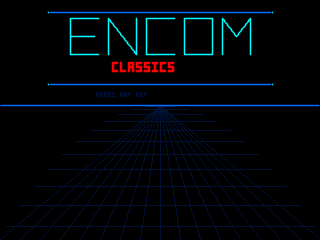
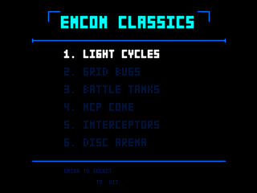
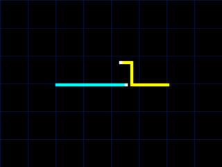
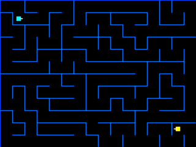
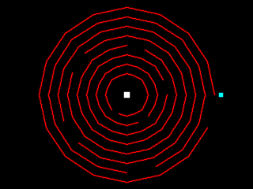
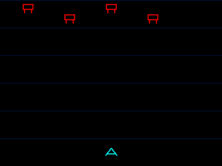
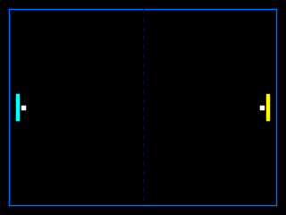

# ENCOM's Hits

Retro arcade game collection in Cyrius. Six games, one engine, neon on black. The art is math.



## The Games

| Game | Mechanic | Lines |
|------|----------|-------|
| **Light Cycles** | Trail walls, last alive wins | 226 |
| **Grid Bugs** | Grid traversal, pathfinding pursuit | 255 |
| **Battle Tanks** | Maze combat, ricochet projectiles | 314 |
| **MCP Cone** | Rotating barriers, timing-based | 315 |
| **Interceptors** | Vertical shooter, wave enemies | 300 |
| **Disc Arena** | 1v1 disc combat, wall ricochets | 292 |



## Build

```sh
cyrius deps                                   # vendor stdlib into lib/ (first build only)
cyrius build src/main.cyr build/encom-hits
./build/encom-hits
```

Requires Cyrius >= 6.5.36.

## Screenshots

Generate all game screenshots as PPM files:

```sh
./build/encom-hits --ppm
```

## Controls

| Action | Player 1 | Player 2 / Alt |
|--------|----------|----------------|
| Move | WASD | Arrow keys |
| Fire / Action | Space | W / Up |
| Select game | 1-6 / Enter | |
| Back / Pause | Escape | |
| Quit | Q | Ctrl+C |

## Visual Style

Neon wireframe on black. No textures, no sprites, no assets. Every pixel is a computed line. 320x240 framebuffer, 8-color neon palette, additive glow bloom.







## Architecture

4,380 lines across 14 source files. Shared engine (framebuffer, drawing, input, glow, AI, grid) with per-game modules.

```
src/
  main.cyr          — Entry, menu, bitmap text, splash, scoring, --ppm mode (1,141)
  engine.cyr        — Framebuffer, /dev/fb0 + PPM output, frame timing (406)
  draw.cyr          — Bresenham line, hline/vline, rect, pixel (153)
  input.cyr         — Terminal raw mode, keyboard state, escape sequences (172)
  glow.cyr          — Additive neon bloom effect (106)
  ai.cyr            — A* (open grid + maze-aware), chase, LC lookahead (412)
  grid.cyr          — Maze generation (iterative backtracker) (193)
  types.cyr         — Colors, constants, game IDs (95)
  lightcycles.cyr   — Light Cycles (226)
  gridbugs.cyr      — Grid Bugs (255)
  tanks.cyr         — Battle Tanks (314)
  mcpcone.cyr       — MCP Cone (315)
  interceptors.cyr  — Interceptors (300)
  discs.cyr         — Disc Arena (292)
```

## License

GPL-3.0-only

---

*End of line.*
